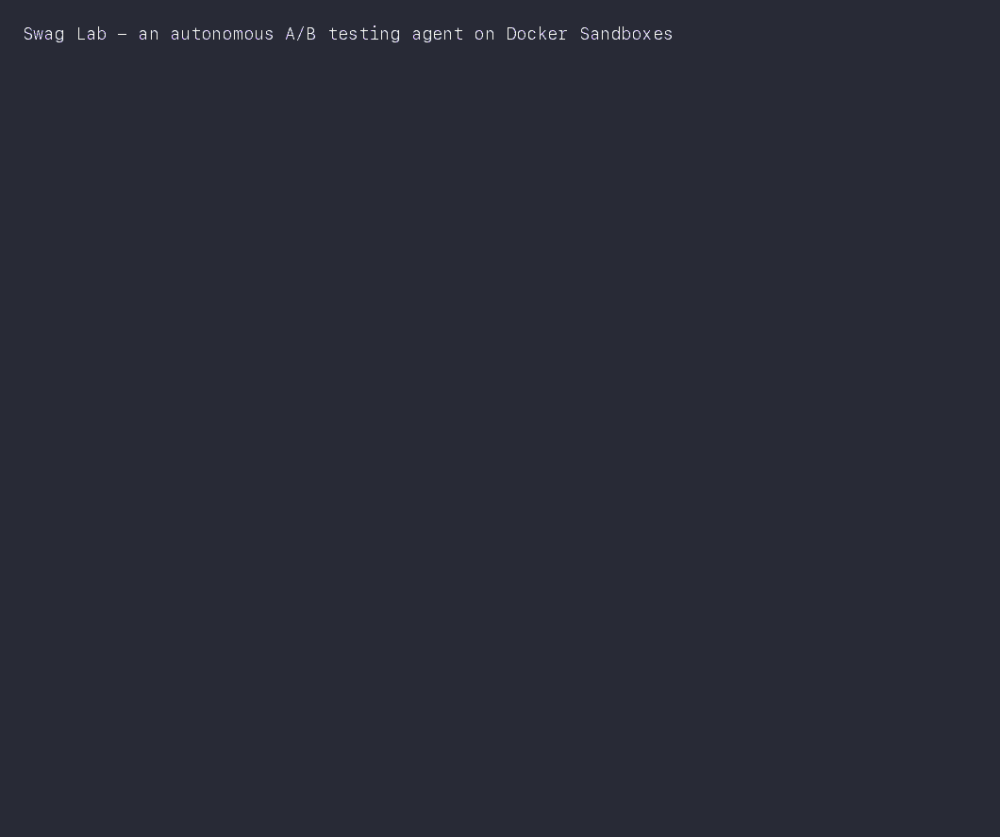

# Demo GIF

A terminal-style playback of the Swag Lab loop (beats 2–6) for the slide deck.



The rendered GIF lives at
`simspace/lab/swag-lab-slides/assets/swag-lab-demo.gif` (so the Simspace deck
can embed it); the README and `DEMO.md` reference that same file.

## Regenerate it

**Primary — Pillow renderer (headless, reproducible, no browser):**

```bash
python3 demo/render_gif.py      # writes the GIF into the slides assets dir
```

Edit the beat content or palette in `render_gif.py`.

**Alternative — live terminal / VHS:**

- `swag-lab-demo.sh` is the same narration as a real shell script — run it in a
  terminal for a live walkthrough.
- `swag-lab-demo.tape` records that script to a GIF with
  [VHS](https://github.com/charmbracelet/vhs) (`vhs demo/swag-lab-demo.tape`).
  VHS needs a working headless-Chrome renderer; on hosts without one, use the
  Pillow path above.

> This is a narration (scripted output), not a live run. The real loop is
> `../orchestrator/run-ab-test.sh`.
